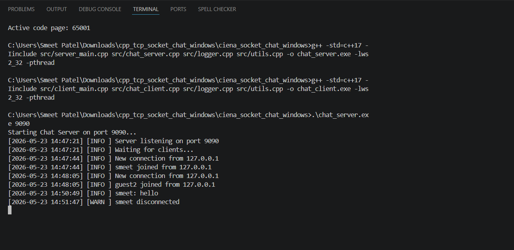
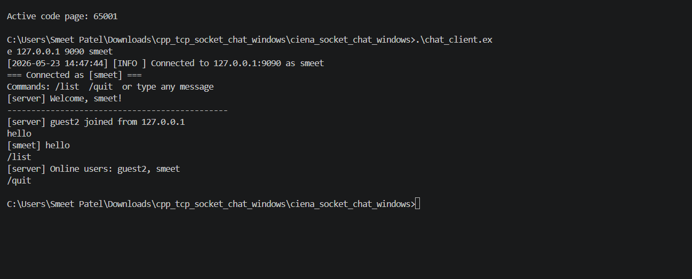
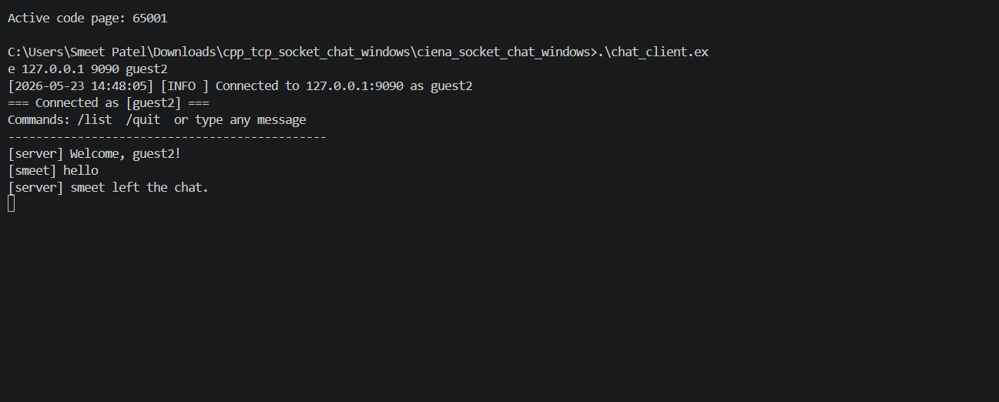

# C++ TCP Socket Chat System

A production-style **multi-client chat application** built with **C++17**, **TCP/IP sockets**, and **multithreading** — compatible with both **Windows (Winsock2)** and **Linux (POSIX)**.

Built to demonstrate key skills: systems-level C++ programming, TCP client-server architecture, concurrency, structured logging, and clean modular code.

---

## Features

- Multi-client TCP chat server
- Username-based join/leave notifications
- Real-time broadcast messaging
- `/list` to view online users
- `/quit` to disconnect gracefully
- Thread-per-client concurrency
- Structured timestamped logging to `.log` files
- Cross-platform: Windows (Winsock2) + Linux (POSIX sockets)
- CMake build system + GitHub Actions CI

---

## Tech Stack

| Area       | Technology                         |
|------------|------------------------------------|
| Language   | C++17                              |
| Networking | Winsock2 (Windows) / POSIX sockets |
| Threads    | `std::thread`, `std::mutex`        |
| Build      | CMake                              |
| CI         | GitHub Actions                     |
| Platform   | Windows / Linux / macOS            |

---

## Project Structure

```bash
cpp-tcp-socket-chat/
├── include/
│   ├── platform.hpp
│   ├── chat_server.hpp
│   ├── chat_client.hpp
│   ├── logger.hpp
│   └── utils.hpp
├── src/
│   ├── server_main.cpp
│   ├── client_main.cpp
│   ├── chat_server.cpp
│   ├── chat_client.cpp
│   ├── logger.cpp
│   └── utils.cpp
├── screenshots/
│   ├── 1socket.png
│   ├── 2socket.png
│   └── 3socket.png
├── CMakeLists.txt
└── README.md
```

---

## Build on Windows (MSYS2 / g++)

```bash
g++ -std=c++17 -Iinclude src/server_main.cpp src/chat_server.cpp src/logger.cpp src/utils.cpp -o chat_server.exe -lws2_32 -pthread

g++ -std=c++17 -Iinclude src/client_main.cpp src/chat_client.cpp src/logger.cpp src/utils.cpp -o chat_client.exe -lws2_32 -pthread
```

---

## Build on Linux / macOS

```bash
g++ -std=c++17 -Iinclude src/server_main.cpp src/chat_server.cpp src/logger.cpp src/utils.cpp -o chat_server -pthread

g++ -std=c++17 -Iinclude src/client_main.cpp src/chat_client.cpp src/logger.cpp src/utils.cpp -o chat_client -pthread
```

---

## Run

### Terminal 1 — Start Server

```bash
.\chat_server.exe 9090
```

### Terminal 2 — Start Client 1

```bash
.\chat_client.exe 127.0.0.1 9090 smeet
```

### Terminal 3 — Start Client 2

```bash
.\chat_client.exe 127.0.0.1 9090 guest2
```

---

## Commands (in client terminal)

| Command  | Action                   |
|----------|--------------------------|
| `/list`  | Show all connected users |
| `/quit`  | Disconnect and exit      |
| any text | Broadcast to all clients |

---

## Demo Output

### Terminal 1 — Server Output

```bash
Starting Chat Server on port 9090...
[2026-05-23 14:47:21] [INFO ] Server listening on port 9090
[2026-05-23 14:47:21] [INFO ] Waiting for clients...
[2026-05-23 14:47:44] [INFO ] New connection from 127.0.0.1
[2026-05-23 14:47:44] [INFO ] smeet joined from 127.0.0.1
[2026-05-23 14:48:05] [INFO ] New connection from 127.0.0.1
[2026-05-23 14:48:05] [INFO ] guest2 joined from 127.0.0.1
```

### Terminal 2 — Client 1 Output

```bash
[2026-05-23 14:47:44] [INFO ] Connected to 127.0.0.1:9090 as smeet
=== Connected as [smeet] ===
Commands: /list  /quit  or type any message
[server] Welcome, smeet!
[server] guest2 joined from 127.0.0.1
```

### Terminal 3 — Client 2 Output

```bash
[2026-05-23 14:48:05] [INFO ] Connected to 127.0.0.1:9090 as guest2
=== Connected as [guest2] ===
Commands: /list  /quit  or type any message
[server] Welcome, guest2!
```

---

## Screenshots

### Terminal 1 — Server (`1socket.png`)



### Terminal 2 — Client 1 (`2socket.png`)



### Terminal 3 — Client 2 (`3socket.png`)



---

## Why This Project Matters

This project demonstrates practical knowledge of:

- **C++ systems programming**
- **TCP/IP socket communication**
- **Client-server architecture**
- **Multithreading and concurrency**
- **Cross-platform networking**
- **Structured logging and debugging**
- **Clean modular code organization**

---

## Future Improvements

- Add private messaging with `/msg <username> <message>`
- Add file transfer between clients
- Add message history persistence
- Add authentication for users
- Add Docker support for easier deployment
- Add scalable event-driven architecture using `select()` or `epoll`

---

## Author

**Smeet Patel**  
- GitHub: [smeetpatel2530](https://github.com/smeetpatel2530)
- LinkedIn: [Smeet Patel](https://www.linkedin.com/in/smeet-patel-22b67a193/)

---
